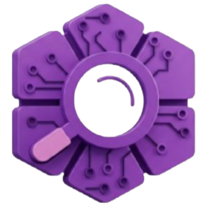

<p align="center">
   <a href="https://github.com/gavindloka/PoR" target="_blank" rel="noopener noreferer">
      
   </a>
</p>
<h1 style="border-bottom: none; margin-bottom: 0" align="center">Proof of Research</h1>
<h4 style="margin-top: 0.4rem; " align="center">Fair and Verified Research Surveys Powered by Decentralized AI</h4>

<br>

## 📖 About Proof of Research

Proof of Research is a blockchain-based platform built on the Internet Computer, enabling research surveys to be permanently stored and verified. To enhance the integrity of the data, the platform utilizes Decentralized AI for facial verification. The system ensures that each participant is uniquely identified, avoiding dishonest or repeated submissions. As an incentive for participation, the platform rewards survey respondents with ICP tokens.

## 📌 Features

- **Immutable Research Data:** Every survey response is permanently stored on the blockchain, ensuring transparency and integrity. Built on the Internet Computer (ICP), the system guarantees data immutability, preventing unauthorized alterations or deletions.
- **AI-Verified Surveys:** Advanced AI validation ensures that survey responses are authentic, bias-free, and trustworthy. Powered by On-Chain Face Recognition AI, the system verifies participant identities securely without compromising privacy. This decentralized approach prevents duplicate submissions and enhances data reliability, making every response verifiable and tamper-proof.
- **Incentivized Participation:** Participants are rewarded with ICP tokens, motivating them to provide high-quality and genuine responses. This blockchain-based incentive system ensures fair compensation while promoting active engagement in research. By integrating transparent and automated rewards, the platform fosters a sustainable ecosystem where both researchers and contributors benefit.
<!--

# 🛠️ Project Setup Guide

This document provides detailed instructions on setting up, running, and troubleshooting the project. -->

## 📦 Prerequisites

Before running this project, ensure you have installed the following dependencies:

- [`Node.js`](https://nodejs.org/en/) `>= 16`
- [`dfx`](https://internetcomputer.org/docs/current/developer-docs/build/install-upgrade-remove) `>= 0.14`

### Install Rust and Required Tools

1. **Install Rust (if not already installed):**
   ```sh
   curl --proto '=https' --tlsv1.2 -sSf https://sh.rustup.rs | sh
   ```
2. **Add WASM and WASI Targets:**
   ```sh
   rustup target add wasm32-wasip1
   ```
3. **Install Required Rust Tools:**
   ```sh
   cargo install wasm-opt
   cargo install wasi2ic
   cargo install ic-file-uploader
   cargo install cargo-watch
   ```

### Install Python and Required Libraries

1. **Install Python and pip (if not already installed):**
   ```sh
   sudo apt-get install python3-pip
   ```
2. **Install Required Python Packages:**
   ```sh
   pip install facenet-pytorch torch onnx
   ```

---

## 🚀 TL;DR - Quick Start Commands

To quickly run the project, execute the following commands in order (assuming all requirements are installed and everything has been set up in order):

```sh
dfx stop
dfx start --clean --background
./deploy-ledger.sh
npm run setup
npm start
dfx canister call auth initialize $(dfx canister id backend_ai)
./upload-models-to-canister.sh
```

## ▶️ Running the Project

### Step 1: Start the DFX (Internet Computer) Local Network

Before running the project, start the DFINITY Canister execution environment:

```sh
 dfx stop  # Stop any existing instance
 dfx start --clean --background  # Start fresh in the background
```

### Step 2: Deploy Ledger Canister

```sh
 ./deploy-ledger.sh
```

### Step 3: Run Setup and Start Application

```sh
 npm run setup  # Set up dependencies
 npm start  # Start the application
```

## 👁️ Face Detection Model

### Step 1: Download Face Detection Model

Run the following command to download the necessary model files:

```sh
 ./download-face-detection-model.sh
```

### Step 2: Create Face Recognition Model (If Not Available)

Face recognition models compute a vector embedding of an image with a face. You can generate a pre-trained model from `facenet-pytorch` using the following steps:

#### Install Dependencies (If Not Installed)

```sh
pip install facenet-pytorch torch onnx
```

#### Export ONNX Model

Create a Python script or run these commands in a Python shell:

```python
import torch
import facenet_pytorch

# Load the pretrained model
resnet = facenet_pytorch.InceptionResnetV1(pretrained='vggface2').eval()

# Create a dummy input tensor
input = torch.randn(1, 3, 160, 160)

# Export model to ONNX format
torch.onnx.export(resnet, input, "face-recognition.onnx", verbose=False, opset_version=11)
```

This will generate a `face-recognition.onnx` file. Copy it to the root of the repository.

## 🤖 Initializing AI Models

After setting up the project and models, initialize the AI system with the following commands:

```sh
 dfx canister call auth initialize $(dfx canister id backend_ai)
 ./upload-models-to-canister.sh
```

## ⚠️ Troubleshooting and Possible Issues

### 1. Line Ending Issues (WSL Users)

If you're running this on WSL (Windows Subsystem for Linux) but your files are saved in Windows, you may run into issues with script execution due to line endings. Convert files to Linux format:

```sh
sed -i 's/
$//' *.sh
```

Alternatively, use `dos2unix`:

```sh
dos2unix *.sh
```

### 2. DFX Start Errors

If `dfx start` fails, try stopping any existing processes and clearing the cache:

```sh
dfx stop
dfx cache delete
```

Then restart the environment.

### 3. Missing Dependencies

If commands fail due to missing dependencies, ensure you have installed all prerequisites mentioned earlier. You may also try:

```sh
rustup update
pip install --upgrade pip
npm install
```

### 4. AI Model Initialization Issues

If `dfx canister call auth initialize` fails, ensure the canister is deployed and running:

```sh
dfx deploy
```

Then retry the initialization command.

## 💬 Contact Information

If any questions occurred, or the need any discussion or details, please contact us:

- **Email:** daviskelvin824@gmail.com
- **Telegram:** https://t.me/davis824
- **Discord:** daviskelvin824
